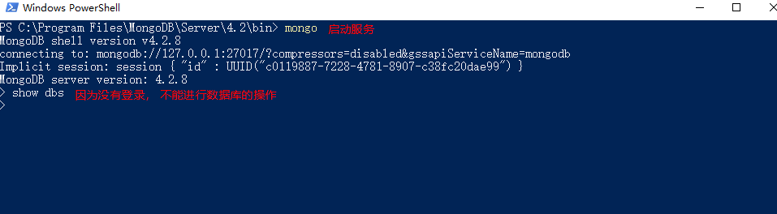
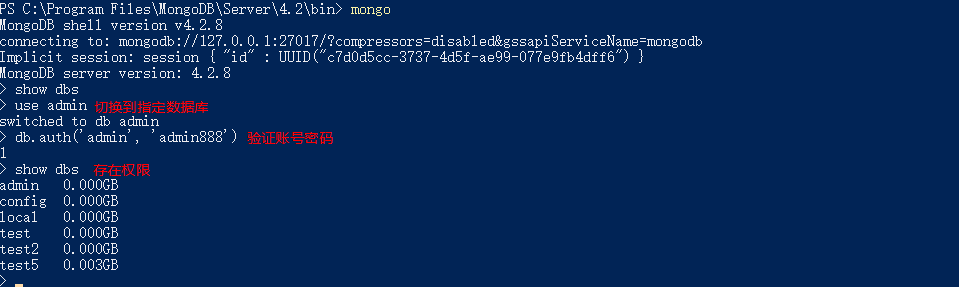

## 1. 相关概念

| 概念        | 描述                        |
| ----------- | --------------------------- |
| database    | 数据库                      |
| collection  | 集合                        |
| document    | 文档                        |
| field       | 域                          |
| index       | 索引                        |
| primary key | 主键，自动将 _id 设置为主键 |


## 2. 数据库操作

### 2.1 查询所有数据库

`show dbs`

### 2.2 切换数据库

 `use name`

### 2.3 创建数据库

 使用 `use` 命令创建数据库， 如果数据库不存在，那么当插入第一条数据时就会创建数据库。如果数据库已经存在则连接数据库

  

### 2.4 删除数据库

 `db.dropDatabase()`

### 2.5 查看当前数据库

 `db` 或者`db.getName()`

```shell
> db
test
```

### 2.6 显示当前数据库状态

 `db.stats()`

  


## 3. 集合操作

### 3.1 创建集合

`db.createCollection('name', options)` -> options 为集合配置项

**在 MongoDB 中，你不需要创建集合。当你插入一些文档时，MongoDB 会自动创建集合。**

```shell
> db.createCollection("round")
{ "ok" : 1 }
> show collections
round

> db.round2.insert({"name": "wen"})
WriteResult({ "nInserted": 1})
> show collections
round
round2
```

### 3.2 删除集合

`db.COLLECTION_NAME.drop()`: 使用 collection 对象的 `drop` 方法

```shell
> show collections
round
round2
> db.round2.drop()
true
> show collections
round
```

### 3.3 查看所有集合

`show collections` (主要) 或 `show tables`

## 4. 文档操作

### 4.1 插入文档

`db.collection.insert(document)`: 若插入的文档主键存在, 那么就抛出错误 -- 如果传入数组, 表示插入多条

```bash
> db.round.insert({ num: 1 })
WriteResult({"nInserted": 1})
```

> **注意：可以通过传入 _id 来覆盖默认的主键**
>
> ```she
> > db.round.insert({ _id: 1, num: 2 })
> WriteResult({ "nInserted" : 1 })
> > db.round.find()
> { "_id" : 1, "num" : 2 }
> ```


### 4.2 删除文档

**执行 remove() 方法之前先执行 find() 判断一下执行条件是否正确是一个好策略**

`db.collection.remove(条件[, 是否删除一条]`

- **query** :（可选）删除的文档的条件。 -- 在 2.6 以后, 必须要传, 如果删除所有文档, 则可以传入 {}, 并且不会删除索引
- 是否删除一条： true 删除一条 | false 删除匹配的全部(默认值)


### 4.3 更新文档

`db.collection.update(条件, 更新数据或一些更新的操作符[, 是否新增, 是否修改多条])`

* 条件：与查询文档的条件一样

* 更新操作符

  * 字段更新操作符: 操作范围为字段

    **注意: key 也可以使用 对象.属性 用来修改字段值为对象的**

    | 操作                                    | 操作符  | 例子                                                         |
    | --------------------------------------- | ------- | ------------------------------------------------------------ |
    | 全部替换                                | null    | { key: value, ... } -- 将文档替换成传入的数据，全部替换      |
    | 修改列 - 如果这个字段不存在，则创建它   | $set    | { $set: { key: value, ... } } -- 只修改指定的列              |
    | 递增(递减) - 如果该键不存在就新创建一个 | $inc    | { $inc: { key: int(数字) } }                                 |
    | 重命名列                                | $rename | { $rename: { key: newKey } } -- 会将指定的列名 key 替换成 newKey |
    | 删除列                                  | $unset  | { $unset: {key: true} } -- 删除指定的列                      |

  * 数组更新操作符: 操作范围为字段值为数组的字段

    | 操作                                             | 操作符 | 例子 |
    | ------------------------------------------------ | ------ | ---- |
    | 向已有数组末尾追加元素，要是不存在就创建一个数组 | $push  | ...  |

* 是否新增：true 不存在则新增 | false 不存在不新增(默认值)

* 是否修改多条：true 将查询的数据全部更新 | false 只更新第一条数据(默认值)


**example1: 全量替换**

```bash
> db.wen.insert([{ name: "温", age: 26, sex: 1 }, { name: "朱", age: 28, sex: 0 }])
> db.wen.find()
{ "_id" : ObjectId("614bd5e8aa76c89e507d6824"), "name" : "温", "age" : 26, "sex": 1 }
{ "_id" : ObjectId("614bd5e8aa76c89e507d6825"), "name" : "朱", "age" : 28, "sex": 0 }
> db.wen.update({ name: "朱" }, { name: "朱永红", age: 18 })
db.wen.update({ name: "朱" }, { name: "朱永红", age: 18 })
> db.wen.find()
{ "_id" : ObjectId("614bd5e8aa76c89e507d6824"), "name" : "温", "age" : 26, "sex": 1 }
{ "_id" : ObjectId("614bd5e8aa76c89e507d6825"), "name" : "朱永红", "age" : 18 }
```

**example2: 使用操作符进行更新**

```bash
> db.wen.update({ name: "温"}, { $set: { name: "温祖彪" }, $inc: { age: 2 }, $unset: { sex: true } })
WriteResult({ "nMatched" : 1, "nUpserted" : 0, "nModified" : 1 })
```


### 4.4 查询文档

`db.collectionName.find(条件[,查询的列])`

* 查询的列 - 不传为查询全部列
  * { key: 0或1}: 0 表示除了 key 列， 1表示只显示 key 列
  * 主键 _id 都会存在

- 条件运算符

  - 比较查询操作符

    | 操作       | 运算符 | 例子                                                         |
    | ---------- | ------ | ------------------------------------------------------------ |
    | 等于       | null   | { key: value }                                               |
    | 小于       | $lt    | { key: { $lt: value } }                                      |
    | 小于或等于 | $lte   | { key: { $lte: value } }                                     |
    | 大于       | $gt    | { key: {$gt: value }}                                        |
    | 大于或等于 | $gte   | { key: {$gte: value} }                                       |
    | 不等于     | $ne    | { key: {$ne: value} }                                        |
    | 包含       | $in    | { key: { $in: [value1, value2,...] } } -- key 在 value1和 value2...之中 |
    | 不包含     | $nit   | { key: { $nit: [value1, value2,...] } }                      |


**example**

* 条件查询，查询title为`MongoDB 教程`的所有文档；

```
db.article.find({'title':'MongoDB 教程'})
```

- 条件查询，查询likes大于50的所有文档；

```
db.article.find({'likes':{$gt:50}})
```

- AND条件可以通过在`find()`方法传入多个键，以逗号隔开来实现，例如查询title为`MongoDB 教程`并且by为`Andy`的所有文档；

```
db.article.find({'title':'MongoDB 教程','by':'Andy'})
```

- OR条件可以通过使用`$or`操作符实现，例如查询title为`Redis 教程`或`MongoDB 教程`的所有文档；

```
db.article.find({$or:[{"title":"Redis 教程"},{"title": "MongoDB 教程"}]})
```

- AND 和 OR条件的联合使用，例如查询likes大于50，并且title为`Redis 教程`或者`"MongoDB 教程`的所有文档。

```
db.article.find({"likes": {$gt:50}, $or: [{"title": "Redis 教程"},{"title": "MongoDB 教程"}]})
```


#### 4.4.1 查询数据总数

`db.collectionName.find(参数).count()`

#### 4.4.2 查询一个文档

`db.collectionName.findOne(条件[,查询的列])`

#### 4.4.3 排序

`db.collectionName.find().sort({ key: 数字 })`

* key 表示需要排序的字段
* 数字：-1 表示降序，1 表示升序

#### 4.4.4 分页

`.skip(数字)`： 跳过指定数量

`.limit数字)`：需要查询的数量

**example: 查询第二页数据, 并且根据 age 排序**

```bash
> db.round.find().sort({ age: -1 }).skip(10).limit(10)
```


## 5. 索引

### 5.1 索引的作用

索引是一种特殊的数据结构，用来提高查询的效率

* 优点：

  > 提高数据查询的效率
  >
  > 通过索引对数据进行排序，降低数据排序的成本，降低 CPU 的消耗

* 缺点：

  > 占用磁盘空间(索引也是一种数据类型)
  >
  > 大量索引反而影响效率，因为每次插入和修改数据都需要更新索引

### 5.2 语法

* 创建索引

  `db.collectionName.createIndex(keys[, optinos])`

  * key： 你要创建的索引字段，1 为指定按升序创建索引，如果你想按降序来创建索引指定为 -1 即可。
  * options： 配置项
    * name： 索引的名称。如果未指定，MongoDB的通过连接索引的字段名和排序顺序生成一个索引名称。

* 删除索引

  * 全部删除 `db.collectionName.dropIndexes()`
  * 指定删除 `db.collectionName.dropIndex(‘索引名称’)

* 查看集合全部索引

  `db.collectionName.getIndexes()`

  ```bash
  > db.c1.getIndexes()
  [
          {
                  "v" : 2,
                  "key" : {
                          "_id" : 1
                  },
                  "name" : "_id_",
                  "ns" : "test5.c1"
          },
          {
                  "v" : 2,
                  "key" : {
                          "name" : 1 // 索引字段名
                  },
                  "name" : "name_1", // 索引名称，默认字段名和排序顺序生成一个索引名称
                  "ns" : "test5.c1", // 数据库集合名
          }
  ]
  ```


### 5.3 创建索引的一般性规则

* 为常做条件、排序、分组的字段建立索引
* 选择唯一性索引(例如邮箱，身份证号)

### 5.4 demo

* 创建复合/组合索引

  就是一次性给两个或多个字段建立索引

  `db.collectionName.createIndex({ key: 方式, key2: 方式... })`

* 创建唯一索引

  **强制要求集合中的索引字段没有重复值** -- 使用 unique 配置项来配置

  `db.collectionName.cretateIndex(keys, { unique: true })`

  ```bash
  > db.c1.insert({name: 'a'})
  WriteResult({ "nInserted" : 1 })
  > db.c1.insert({name: 'a'}) # 因为设置了唯一索引，当再次添加相同数据时就会报错
  WriteResult({
          "nInserted" : 0,
          "writeError" : {
                  "code" : 11000,
                  "errmsg" : "E11000 duplicate key error collection: test5.c1 index: name_1 dup key: { name: \"a\" }"
          }
  })
  ```


## 6. 权限设置

语法：

```bash
db.createUser({
	"user": "账号",
	"pwd": "密码",
	"roles": [{
		role: "角色",
		db: "所属数据库"
	}]
})

# 角色种类
超级用户角色: root
数据库用户角色：read、readWrite;
数据库管理角色：dbAdmin、userAdmin；
集群管理角色:clusterAdmin、...

# 角色说明
root：只在 admin 数据库中可用。超级账号，超级权限；
read：允许用户读取指定数据库；
readWrite：允许用户读写指定数据库
```


### 6.1 设置步骤

```tex
1. 添加超级管理员
2. 退出卸载服务
3. 重新安装需要输入账号密码的服务(在原安装命令基础上加上 --auth 即可)
4. 启动服务 -> 登陆测试
```

1. 添加超级管理员

   ```bash
   # 切换到 admin 数据库
   > use admin 
   > db.createUser({
   	"user": "admin",
   	"pwd": "admin888",
   	"roles": [{
   		role: "root",
   		db: "admin"
   	}]
   })
   ```

2. 卸载 mongod 服务

   **注意：cmd 窗口需要以管理员身份运行(搜索 cmd 程序，右键点击菜单选择即可)**

   ```bash
   # 进入到 mongoDB 目录
   C:\>cd C:\Program Files\MongoDB\Server\4.2\bin
   # 卸载 mongod 服务
   C:\Program Files\MongoDB\Server\4.2\bin>mongod --remove
   2021-09-24T23:17:42.997+0800 I  CONTROL  [main] Automatically disabling TLS 1.0, to force-enable TLS 1.0 specify --sslDisabledProtocols 'none'
   2021-09-24T23:17:43.002+0800 W  ASIO     [main] No TransportLayer configured during NetworkInterface startup
   2021-09-24T23:17:43.002+0800 I  CONTROL  [main] Trying to remove Windows service 'MongoDB'
   2021-09-24T23:17:44.130+0800 I  CONTROL  [main] Service MongoDB is currently running, stopping service
   2021-09-24T23:17:44.131+0800 I  CONTROL  [main] Service 'MongoDB' stopped
   2021-09-24T23:17:44.135+0800 I  CONTROL  [main] Service 'MongoDB' removed
   ```

3. 安装需要身份验证的 MongoDB 服务

   `mongod --install --dbpath 存放数据的目录 --logpath 存放日志的目录(或文件，不能重复) --auth`

   ```bash
   # 因为文件路径存在空格， 所以使用 “”来包裹
   > mongod --install --dbpath “C:\Program Files\MongoDB\Server\4.2\data” --logpath “C:\Program Files\MongoDB\Server\4.2\log\mongodb2.log” --auth
   # 上一步成功不会有结果
   > net start mongodb
   MongoDB 服务正在启动 .
   MongoDB 服务已经启动成功。
   ```

4. 启动服务 -> 登录测试

   

### 6.2 账号密码登录

* 方式一

  `mongo 地址(location或127.0.0.1):端口/数据库 -u 账号 -p 密码`

  ```bash
  mongo 127.0.0.1:27017/admin -u admin -p admin888
  ```

* 方式二： 先切换到数据库，在账号密码登录

  

  

### 6.3 创建其他用户

1. 通过 admin 超级管理员登录数据库

2. 切换到需要用户的数据库

   `use 数据库`

3. 创建用户

   > db.createUser({
   > 	"user": "账号",
   > 	"pwd": "密码",
   > 	"roles": [{
   > 		role: "角色",
   > 		db: "所属数据库"
   > 	}]
   > })

4. 使用创建的用户进行登录

   [登录方式](#6.2 账号密码登录)

### 6.4 查看数据库用户

`show users`

## 7. 备份还原

### 7.1 备份

`mongodump -h -port -u -p -d -o`

* -h： host 服务器 IP 地址(不写默认本机)
* -port： 端口(默认 27017)
* -u：账号 --- **备份全局可用 admin 超级管理员，备份指定数据库使用数据库的用户**
* -p：密码
* -d：database 数据库(不写默认导出全局)
* -o：备份到指定目录下

### 7.2 还原

`mongorestore -h -port -u -p -d --drop 备份数据目录`

* -d：指定数据库(不写则还原全部数据库)
* --drop：先删除数据库再导入


参考文档：

* [b 站教程](https://www.bilibili.com/video/BV1xz4y1X7cE?p=18&spm_id_from=pageDriver)

