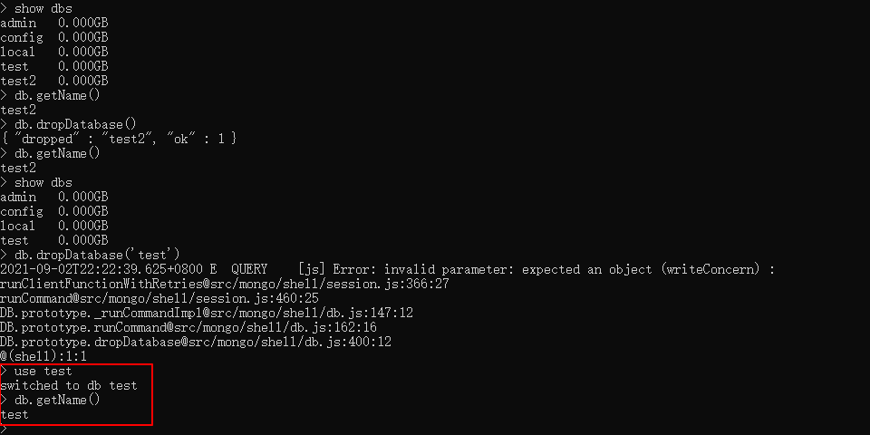
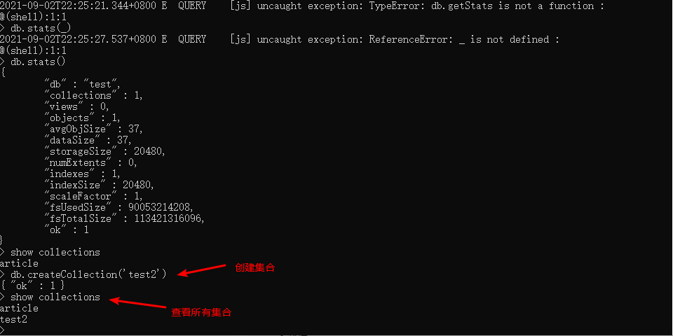

## 1. 相关概念

| 概念        | 描述                        |
| ----------- | --------------------------- |
| database    | 数据库                      |
| collection  | 集合                        |
| document    | 文档                        |
| field       | 域                          |
| index       | 索引                        |
| primary key | 主键，自动将 _id 设置为主键 |


## 2. 数据库操作

### 2.1 查询所有数据库

`show dbs`

### 2.2 切换数据库

 `use name`

### 2.3 创建数据库

 使用 `use` 命令创建数据库， 如果数据库不存在，那么当插入第一条数据时就会创建数据库。如果数据库已经存在则连接数据库

  

### 2.4 删除数据库

 `db.dropDatabase()`

### 2.5 查看当前数据库

 `db.getName()`



### 2.6 显示当前数据库状态

 `db.stats()`

  


## 3. 集合操作

### 3.1 创建集合

`db.createCollection('name', options)` -> options 为集合配置项



### 3.2 删除集合

`db.article.drop()`: 使用 collection 对象的 `drop` 方法

```shell
> db.article.drop()
true
> show collections
```

## 4. 文档操作

具体最好参照 node 包一起复习


参考文档：

* [MongoDB常用数据库命令大全](https://www.jb51.net/article/179844.htm)
* [MongoDB快速入门，掌握这些刚刚好！](https://juejin.cn/post/6844904150635921422#heading-7)