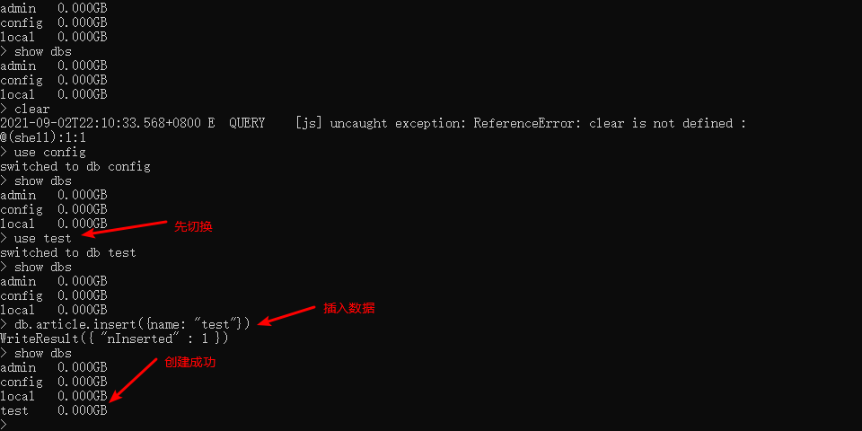
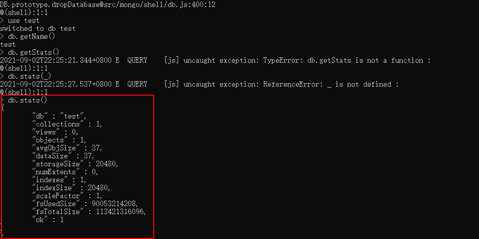

## 1. 相关概念

| 概念        | 描述                        |
| ----------- | --------------------------- |
| database    | 数据库                      |
| collection  | 集合                        |
| document    | 文档                        |
| field       | 域                          |
| index       | 索引                        |
| primary key | 主键，自动将 _id 设置为主键 |


## 2. 数据库操作

### 2.1 查询所有数据库

`show dbs`

### 2.2 切换数据库

 `use name`

### 2.3 创建数据库

 使用 `use` 命令创建数据库， 如果数据库不存在，那么当插入第一条数据时就会创建数据库。如果数据库已经存在则连接数据库

  

### 2.4 删除数据库

 `db.dropDatabase()`

### 2.5 查看当前数据库

 `db` 或者`db.getName()`

```shell
> db
test
```

### 2.6 显示当前数据库状态

 `db.stats()`

  


## 3. 集合操作

### 3.1 创建集合

`db.createCollection('name', options)` -> options 为集合配置项

**在 MongoDB 中，你不需要创建集合。当你插入一些文档时，MongoDB 会自动创建集合。**

```shell
> db.createCollection("round")
{ "ok" : 1 }
> show collections
round

> db.round2.insert({"name": "wen"})
WriteResult({ "nInserted": 1})
> show collections
round
round2
```

### 3.2 删除集合

`db.COLLECTION_NAME.drop()`: 使用 collection 对象的 `drop` 方法

```shell
> show collections
round
round2
> db.round2.drop()
true
> show collections
round
```

### 3.3 查看所有集合

`show collections` (主要) 或 `show tables`

## 4. 文档操作

### 4.1 插入文档

`db.collection.insert(document)`: 若插入的文档主键存在, 那么就抛出错误 -- 如果传入数组, 表示插入多条

```bash
> db.round.insert({ num: 1 })
WriteResult({"nInserted": 1})
```

> **注意：可以通过传入 _id 来覆盖默认的主键**
>
> ```she
> > db.round.insert({ _id: 1, num: 2 })
> WriteResult({ "nInserted" : 1 })
> > db.round.find()
> { "_id" : 1, "num" : 2 }
> ```


### 4.2 删除文档

**执行 remove() 方法之前先执行 find() 判断一下执行条件是否正确是一个好策略**

`db.collection.remove(条件[, 是否删除一条]`

- **query** :（可选）删除的文档的条件。 -- 在 2.6 以后, 必须要传, 如果删除所有文档, 则可以传入 {}, 并且不会删除索引
- 是否删除一条： true 删除一条 | false 删除匹配的全部(默认值)


### 4.3 更新文档

`db.collection.update(条件, 更新数据或一些更新的操作符[, 是否新增, 是否修改多条])`

* 条件：与查询文档的条件一样

* 更新操作符

  * 字段更新操作符: 操作范围为字段

    **注意: key 也可以使用 对象.属性 用来修改字段值为对象的**

    | 操作                                    | 操作符  | 例子                                                         |
    | --------------------------------------- | ------- | ------------------------------------------------------------ |
    | 全部替换                                | null    | { key: value, ... } -- 将文档替换成传入的数据，全部替换      |
    | 修改列 - 如果这个字段不存在，则创建它   | $set    | { $set: { key: value, ... } } -- 只修改指定的列              |
    | 递增(递减) - 如果该键不存在就新创建一个 | $inc    | { $inc: { key: int(数字) } }                                 |
    | 重命名列                                | $rename | { $rename: { key: newKey } } -- 会将指定的列名 key 替换成 newKey |
    | 删除列                                  | $unset  | { $unset: {key: true} } -- 删除指定的列                      |

  * 数组更新操作符: 操作范围为字段值为数组的字段

    | 操作                                             | 操作符 | 例子 |
    | ------------------------------------------------ | ------ | ---- |
    | 向已有数组末尾追加元素，要是不存在就创建一个数组 | $push  | ...  |

* 是否新增：true 不存在则新增 | false 不存在不新增(默认值)

* 是否修改多条：true 将查询的数据全部更新 | false 只更新第一条数据(默认值)


**example1: 全量替换**

```bash
> db.wen.insert([{ name: "温", age: 26, sex: 1 }, { name: "朱", age: 28, sex: 0 }])
> db.wen.find()
{ "_id" : ObjectId("614bd5e8aa76c89e507d6824"), "name" : "温", "age" : 26, "sex": 1 }
{ "_id" : ObjectId("614bd5e8aa76c89e507d6825"), "name" : "朱", "age" : 28, "sex": 0 }
> db.wen.update({ name: "朱" }, { name: "朱永红", age: 18 })
db.wen.update({ name: "朱" }, { name: "朱永红", age: 18 })
> db.wen.find()
{ "_id" : ObjectId("614bd5e8aa76c89e507d6824"), "name" : "温", "age" : 26, "sex": 1 }
{ "_id" : ObjectId("614bd5e8aa76c89e507d6825"), "name" : "朱永红", "age" : 18 }
```

**example2: 使用操作符进行更新**

```bash
> db.wen.update({ name: "温"}, { $set: { name: "温祖彪" }, $inc: { age: 2 }, $unset: { sex: true } })
WriteResult({ "nMatched" : 1, "nUpserted" : 0, "nModified" : 1 })
```


### 4.4 查询文档

`db.collectionName.find(条件[,查询的列])`

* 查询的列 - 不传为查询全部列
  * { key: 0或1}: 0 表示除了 key 列， 1表示只显示 key 列
  * 主键 _id 都会存在

- 条件运算符

  - 比较查询操作符

    | 操作       | 运算符 | 例子                                                         |
    | ---------- | ------ | ------------------------------------------------------------ |
    | 等于       | null   | { key: value }                                               |
    | 小于       | $lt    | { key: { $lt: value } }                                      |
    | 小于或等于 | $lte   | { key: { $lte: value } }                                     |
    | 大于       | $gt    | { key: {$gt: value }}                                        |
    | 大于或等于 | $gte   | { key: {$gte: value} }                                       |
    | 不等于     | $ne    | { key: {$ne: value} }                                        |
    | 包含       | $in    | { key: { $in: [value1, value2,...] } } -- key 在 value1和 value2...之中 |
    | 不包含     | $nit   | { key: { $nit: [value1, value2,...] } }                      |

    

- 条件查询，查询title为`MongoDB 教程`的所有文档；

```
db.article.find({'title':'MongoDB 教程'})
```

- 条件查询，查询likes大于50的所有文档；

```
db.article.find({'likes':{$gt:50}})
```

- AND条件可以通过在`find()`方法传入多个键，以逗号隔开来实现，例如查询title为`MongoDB 教程`并且by为`Andy`的所有文档；

```
db.article.find({'title':'MongoDB 教程','by':'Andy'})
```

- OR条件可以通过使用`$or`操作符实现，例如查询title为`Redis 教程`或`MongoDB 教程`的所有文档；

```
db.article.find({$or:[{"title":"Redis 教程"},{"title": "MongoDB 教程"}]})
```

- AND 和 OR条件的联合使用，例如查询likes大于50，并且title为`Redis 教程`或者`"MongoDB 教程`的所有文档。

```
db.article.find({"likes": {$gt:50}, $or: [{"title": "Redis 教程"},{"title": "MongoDB 教程"}]})
```


#### 4.4.1 查询数据总数

`db.collectionName.find(参数).count()`

#### 4.4.2 查询一个文档

`db.collectionName.findOne(条件[,查询的列])`

参考文档：

* [MongoDB常用数据库命令大全](https://www.jb51.net/article/179844.htm)
* [MongoDB快速入门，掌握这些刚刚好！](https://juejin.cn/post/6844904150635921422#heading-7)
* [菜鸟教程](https://www.runoob.com/mongodb/mongodb-remove.html)

