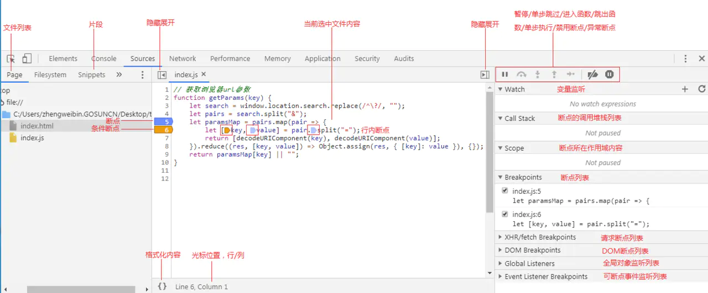
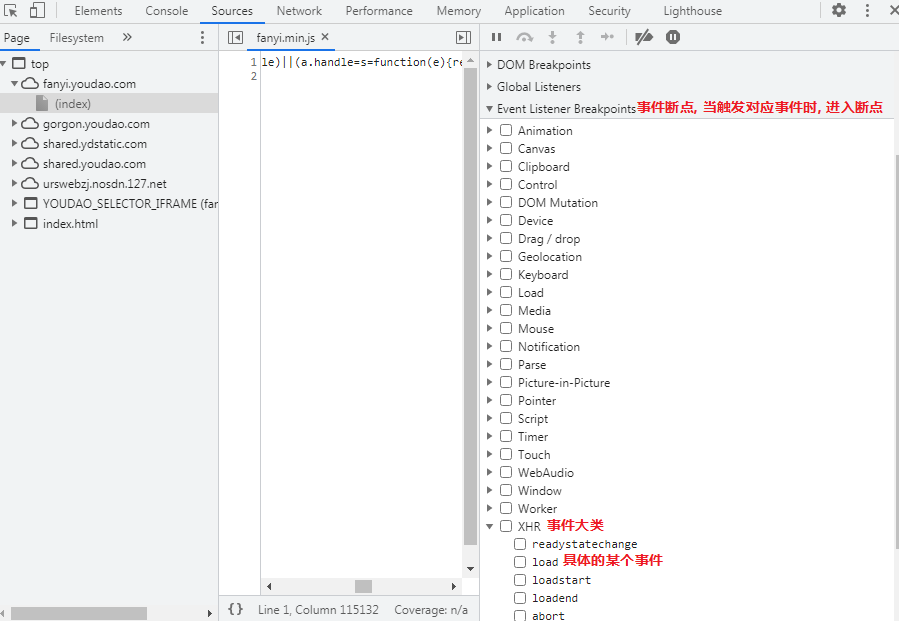
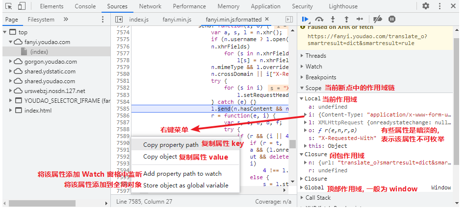
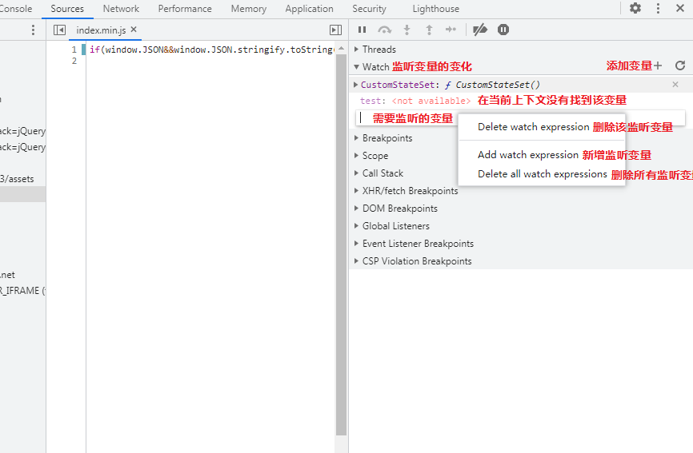

## 0. Sources 面板全览

## 1 设置断点

**注意: 如果一个表达式占了多行，并且你把一个行断点放在这个表达式的中间，DevTools会在下一个表达式上设置断点。**

## 2 右侧 Breakpoins 窗格

## 3 右侧 DOM Breakpoins 窗格

在 `Elements` 面板中, 右键某个元素出现菜单, 选择  Break on 任一个, 都会监听这个元素的 DOM 断点

## 4 右侧 XHR/fetch Berakpoins 窗格

监听 XHR/fetch 断点

## 5 右侧 Event Listener Breakpoints 窗格

**侦听某个事件的断点**

## 6 右侧可点击图标

| 图标 / 按钮                  | 功能                   | 描述                                                         |
| :--------------------------- | :--------------------- | :----------------------------------------------------------- |
|  | Resume                 | 恢复执行直到下一个断点。如果没有遇到断点，则恢复正常执行。   |
|          | Long Resume            | 恢复执行断点禁用500ms。（愚人码头注：所有的暂停都阻塞 500 毫秒后恢复）方便随时跳过断点，否则将继续暂停代码，例如循环内的断点。**单击并按住\*Resume\*按钮，直到展开以显示该操作按钮。** |
|          | Step Over              | 执行下一行中发生的任何操作，并跳转到下一行。                 |
|          | Step Into              | 如果下一行包含一个函数调用，*Step Into*将跳转到该函数并在该函数的第一行暂停。 |
|          | Step Out               | 执行当前函数的剩余部分，然后在函数调用后的下一个语句处暂停。 |
|          | Deactivate breakpoints | 暂时禁用所有断点。 用于恢复完整的执行，而不实际删除你的断点。 再次单击可以重新激活断点。 |
|          | Pause on exceptions    | 当异常发生时自动暂停代码。                                   |

## 7 右侧 Scope 窗格 - 作用域

## 8 右侧 Call Stack 窗格 - 调用堆栈

## 9. 右侧 Watch 窗格 - 监听变量

## 10. 右侧 Global Listeners 窗格 - 全局事件

**管理着全局事件**

## 11. 左侧 Snippets 窗格 - 代码片段

- 代码片段是可以从任何页面上运行的小脚本（类似于书签）。
- 使用`Evaluate in Console`(在控制台中评估)功能在控制台中运行部分的代码片段。
- 请记住，`Sources`(源文件)面板中的热门功能（如断点）也适用于代码片段。

## 12. 左侧 Page 窗格 - 已加载的资源

**展示的是已加载的资源, 以域名为划分**

## 13. 左侧 Filesystem & Overrides & Content scripts

* `Filesystem & Overrides` 可以加载本地文件夹

* `Content scripts` 扩展工具的脚本，比如百度翻译插件等

  
