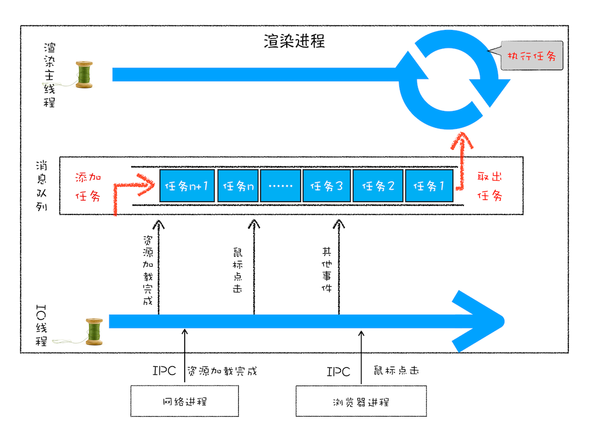
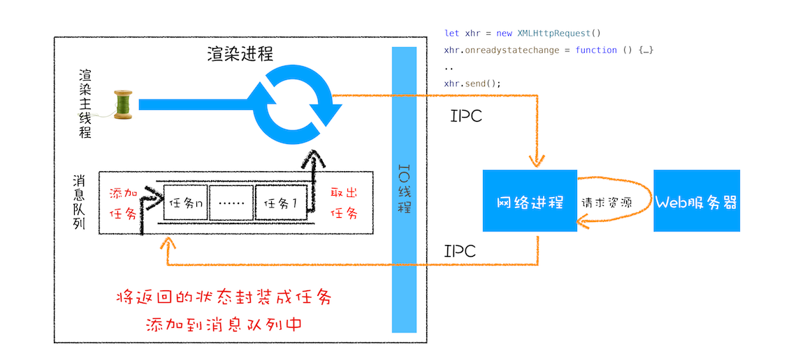
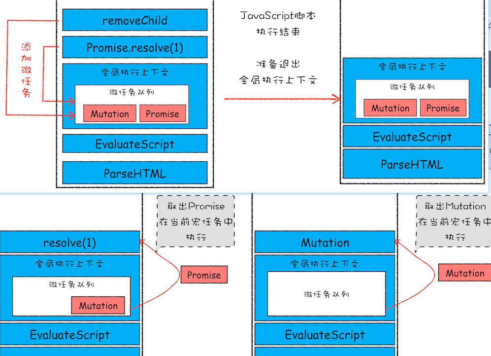
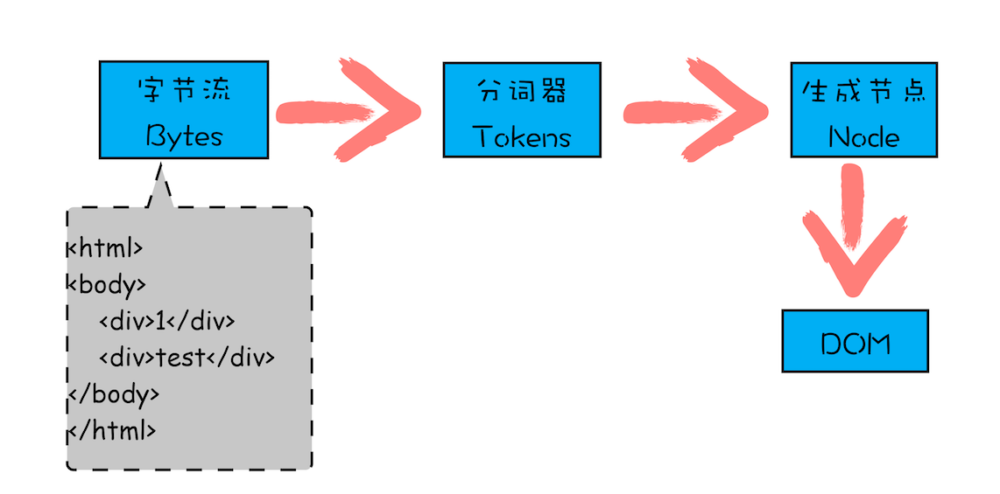
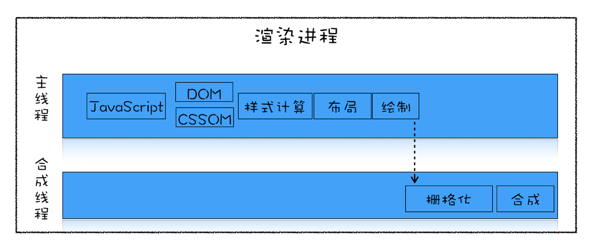

* 消息队列: 是一种数据结构，可以存放要执行的任务。它符合队列“先进先出”的特点，也就是说要添加任务的话，添加到队列的尾部；要取出任务的话，从队列头部去取。

* 事件循环: 是一种概念, 是用来循环消息队列, 执行任务

  

* 延迟队列: 独立于消息队列, 与消息队列类似, 维护着一些需要延迟执行的任务列表, 包括了**定时器和Chromium 内部一些需要延迟执行的任务**

  在合适的时机会将延迟队列的任务推入到消息队列中

* xhr 机制图解

  

* 消息队列

  * 宏任务: 包括如下任务:

    * 渲染事件（如解析 DOM、计算布局、绘制）；
    * 用户交互事件（如鼠标点击、滚动页面、放大缩小等）；
    * JavaScript 脚本执行事件；
    * 网络请求完成、文件读写完成事件。

  * 微任务: 当执行一段 js 脚本时,  V8 会为其创建一个全局执行上下文, **同时也会创建一个微任务队列, 用来存放微任务列表. 也就是说, 每个宏任务都关联了一个微任务队列**

    * promise

    * MutationObserver

      

* DOM: 对 HTML 结构化的表述

  * 从页面角度看,  DOM 是生成页面的基础数据结构
  * 从 js 脚本角度看, DOM 是提供给 js 脚本操作的接口
  * 从安全脚本看, DOM 会将一些不安全的内容排除

* 渲染进程中存在一个 HTML 解析器, 负责解析 DOM, **HTML 解析器并不是等待整个文档加载完毕后才开始解析, 而是网络进程加载了多少数据, HTML 解析器就解析多少数据**

  

* js 阻塞 DOM 的解析: 在解析 DOM 的过程中, 遇到 js 脚本时, 就会暂停 DOM 解析过程, **因为在 js 脚本中, 可能会存在修改 DOM 树的操作**

* css 可能会阻塞 DOM 的解析: 在执行 js 脚本的过程中, 如果执行了样式操作, **那么脚本就需要等待 css 解析后在进行样式操作(存疑), 那么就简介阻塞了 DOM 的解析**

  

* CSSOM: 将 css 解析成渲染进程能够理解的数据结构

  * 作用一: 提供给 js 脚本进行样式操作
  * 作用二: 为布局树的合成提供基础的样式信息

* 重排, 重绘, 合成

  * 重排: 需要更新完整的渲染流水线

    

  * 重绘: 重绘省去了布局和分层阶段，所以执行效率会比重排操作要高一些。

    

  * 分层和合成: **将页面分解为多个图层的操作就称为分层，最后将这些图层合并到一起的操作就称为合成。**

    **合成操作是在合成线程上完成的，这也就意味着在执行合成操作时，是不会影响到主线程执行的。这就是为什么经常主线程卡住了，但是 CSS 动画依然能执行的原因。**

* 交互阶段的渲染流水线

  
