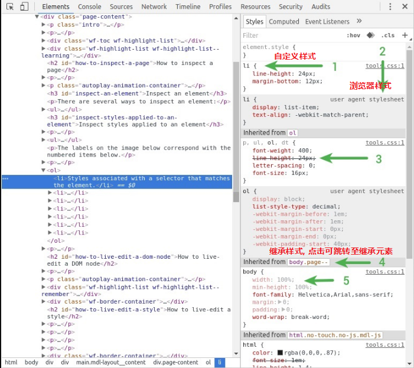
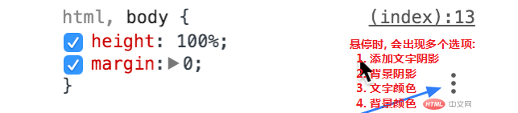
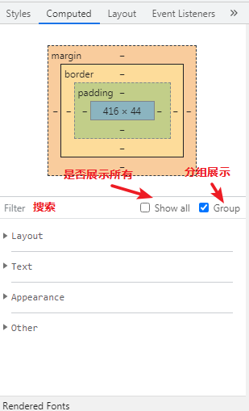
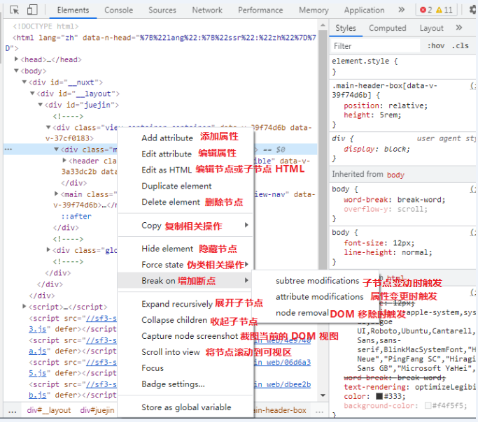

## 1. css 样式

### 1.1 样式分类

### 1.2 添加, 启用, 禁用 css 类

### 1.3 编辑现有属性名或值

当编辑数字的CSS属性值时，使用以下键盘快捷键进行递增和递减：

- Up和Down键，属性值将递增和递减`1`，或者，如果当前属性的值在`-1`和`1`之间，那么将递增和递减`.1` 。
- **Alt+Up和Alt+Down，值将递增和递减`0.1`。**
- Shift+Up递增`10`，Shift+Down递减`10`。
- Shift+Page Up（Windows，Linux）或Shift+Function+Up（Mac）将值递增`100`。Shift+Page Down（Windows，Linux）或Shift+Function+Down（Mac）将值递减`100`。
- 注：当然你可以使用鼠标滚了，来递增或递减值。

### 1.4 添加或删除伪类

伪类: `:active`, `:focus`, `:hover`, 和 `:visited` 等

有两种方式设置:

* 右键单击`Elements`(元素)面板中的元素,然后从菜单中选择目标伪类以启用或禁用它。

  

* 在`Elements`(元素)面板中选择一个元素, 点击`Styles`(样式)窗格中的 `:hov`()按钮, 并使用复选框来启用或者禁用当前所选元素的选择器.

  

### 1.5 添加背景颜色或颜色到一个样式规则

注: 在当前 91 版本下倒是没有看到这个功能, 原因未知, 而在 71 版本下倒是存在

### 1.6 计算样式 - Computed 窗格

可通过在 `Elements` 面板中的 `Computed` **窗格中可查看元素的所有样式**

## 2. DOM 操作

### 2.1 DOM 节点层次关系

DevTools在屑跟踪跟踪器中显示尽可能多的节点元素。如果整个跟踪的节点元素显示不下，省略号（...）表示隐藏部分节点元素。单击省略号来显示隐藏的元素

### 2.2 移动 DOM 节点

点击，按住（鼠标左键）并拖动节点就可以移动该节点，拖动到蓝线表示的相应位置，释放鼠标左键即可。

### 2.3 右键元素的更多菜单

### 2.4 元素事件处理 - Event Listeners 窗格

**在 `Elements`** 面板 `Event Listeners` 窗格中查看

### 2.5 元素断点 - DOM Breakpoints 窗格

### 2.6 元素 DOM 对象 - Properties 窗格

`Properties` 窗格管理着该元素的 DOM 结构原型链

### 2.7 元素 flex, grid 布局 - Layout 窗格

`Layout` 窗格管理着页面所有的 flexbox 和 grid 布局元素

