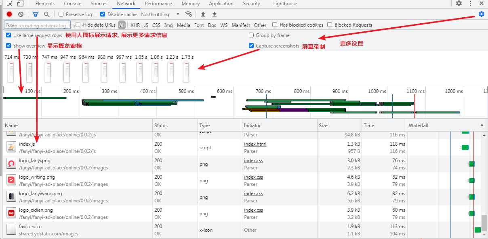
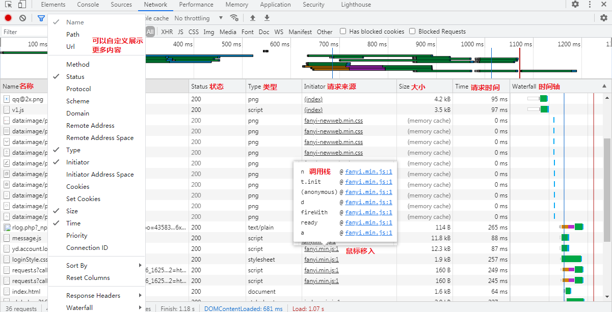
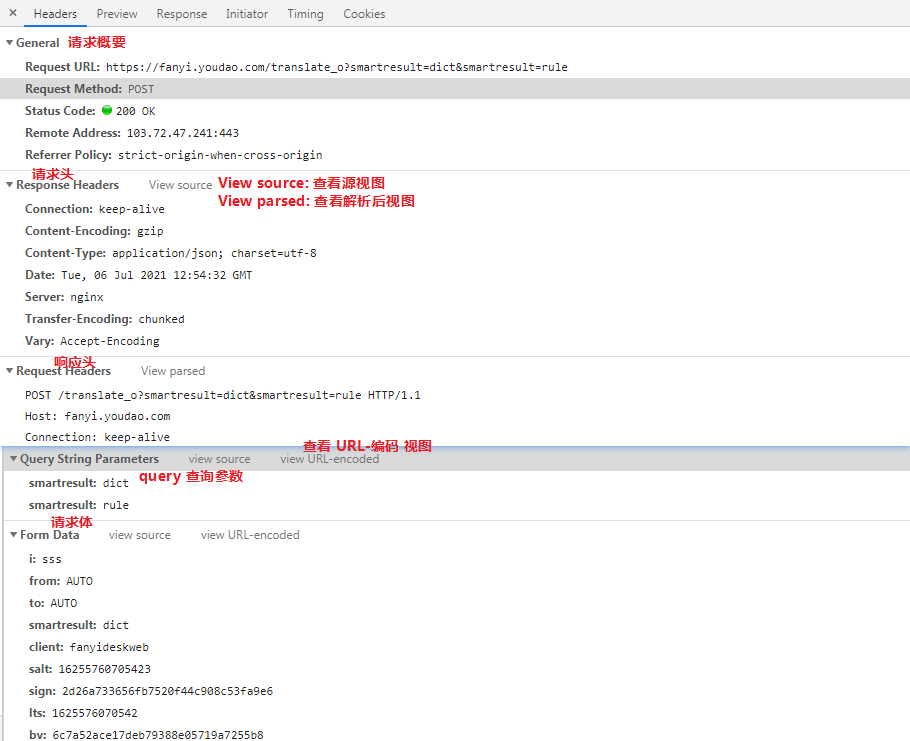
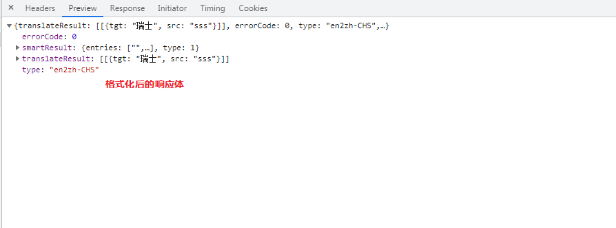
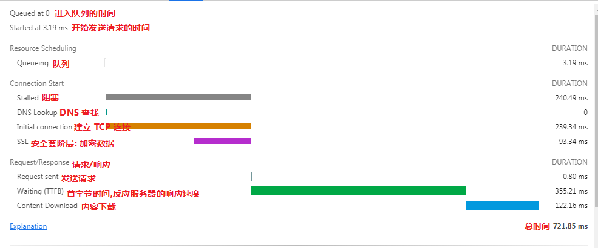

## 1. Network 面板概览

网络面板包含5个窗格：

1. **`Controls`(控件)**: 使用这些选项可以控制 `Network`(网络)面板的外观和功能。
2. **`Filters`(过滤器)**: 使用这些选项可以控制在请求列表中显示哪些资源。提示：按住Cmd（Mac）或Ctrl（Window / Linux），然后点击过滤器可以同时选择多个过滤器。
3. **`Overview`(概览)**: 这个图表显示检索资源的时间轴。如果您看到多个垂直堆叠的栏，这意味着这些资源被同时检索。
4. **`Requests Table`(请求列表)**: 此列表列出了检索的每个资源。默认情况下，此表按时间顺序排序，也就是最早的资源在顶部。单击资源名称可以获得更多信息。提示：右键单击列表的任何标题栏可以以添加或删除信息列。
5. **`Summary`(概要)**: 概要窗格告诉您请求的总数，传输的数据量，和加载时间。

## 2. Controls 控件窗格

**使用这些选项可以控制 `Network`(网络)面板的外观和功能。**

## 3. 右侧更多设置

## 4. Filters - 过滤器窗格

**使用这些选项可以控制在请求列表中显示哪些资源。提示：按住Cmd（Mac）或Ctrl（Window / Linux），然后点击过滤器可以同时选择多个过滤器。**

## 5. Overview - 概览窗格

**这个图表显示检索资源的时间轴。如果您看到多个垂直堆叠的栏，这意味着这些资源被同时检索。**

## 6. Requests Table 请求列表窗格

**此列表列出了检索的每个资源。默认情况下，此表按时间顺序排序，也就是最早的资源在顶部。单击资源名称可以获得更多信息。提示：右键单击列表的任何标题栏可以以添加或删除信息列。**

## 6.1 

### 6.2 请求详细信息

- **`Headers`(标头)** : 与资源相关的HTTP头。

  

- **`Preview`(预览)** : 预览JSON，图片和文字资源。可能显示或不显示任何有用的信息， 具体取决于您选择查看的资源类型。

  

- **`Response`(响应)** : HTTP响应数据（如果有）。 -- 查看该资源未格式化的HTTP响应内容

  ​	

- **`Timing`(时序)** : 查看单个资源的请求生命周期的明细分类。

  [参考资料](https://www.html.cn/doc/chrome-devtools/network-performance/understanding-resource-timing/)

  

  - **Queuing(排队)**

    如果一个请求排队，则表明：

    - 请求被渲染引擎推迟，因为它被认为比关键资源（如脚本/样式）的优先级低。这经常发生在 images（图像） 上。
    - 这个请求被搁置，在等待一个即将被释放的不可用的TCP socket。
    - 这个请求被搁置，因为浏览器限制。在HTTP 1协议中，每个源上只能有6个TCP连接
    - 正在生成磁盘缓存条目（通常非常快）。

  - **Stalled/Blocking (停止/阻塞)**

    - 发送请求之前等待的时间。它可能因为进入队列的任意原因而被阻塞。这个时间包括代理协商的时间。

  - **Proxy Negotiation (代理协商)**

    - 与代理服务器连接协商花费的时间。

  - **DNS Lookup (DNS查找)**

    - 执行DNS查找所用的时间。 页面上的每个新域都需要完整的往返(roundtrip)才能进行DNS查找。

  - **Initial Connection / Connecting (初始连接/连接)**

    - 建立连接所需的时间， 包括TCP握手/重试和协商SSL。

  - **SSL**

    - 完成SSL握手所用的时间。

  - **Request Sent / Sending (请求已发送/正在发送)**

    - 发出网络请求所花费的时间。 通常是几分之一毫秒。

  - **Waiting (TTFB) (等待)**

    - 等待初始响应所花费的时间，也称为`Time To First Byte`(接收到第一个字节所花费的时间)。这个时间除了等待服务器传递响应所花费的时间之外，还捕获到服务器发送数据的延迟时间。

  - **Content Download / Downloading (内容下载/下载)**

    - 接收响应数据所花费的时间。(愚人码头注：从接收到第一个字节开始，到下载完最后一个字节结束)

- `Cookies`:  查看资源的HTTP请求和响应头信息中传输的`Cookie`列表

  

  - **`Name`(名称)** : Cookie的名称。
  - **`Value`(值)** : Cookie的值。
  - **`Domain`(域)** : Cookie所属的域。
  - **`Path`(路径)** : Cookie来自的网址路径。
  - **`Expires / Max-Age`(到期/最大可用时间)** : Cookie的有效期或`max-age`属性的值。
  - **`Size`(尺寸)** : Cookie的大小（以字节为单位）。
  - **`HTTP`** : 表示Cookie只能由浏览器在HTTP请求中设置，且无法使用JavaScript访问。
  - **`Secure`(安全)** :  此属性的存在表示Cookie只能通过安全连接传输(愚人码头注：HTTPS协议传输)。