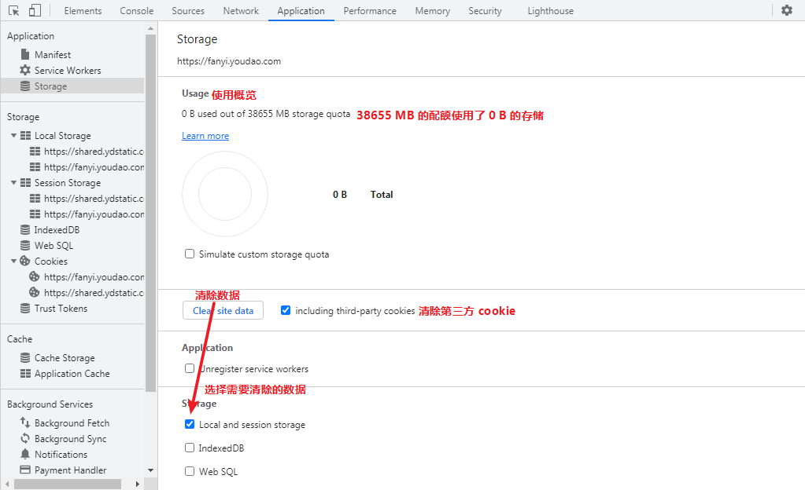

## 1. Application 类别

### 1.1 Manifest - 缓存

Manifest 缓存设置 - 暂不了解

### 1.2 Service Workers - 离线应用

Service Workers 专注与解决 Web 的离线体验, 暂不了解

### 1.3 Storage - 存储概览

## 2. Storage 存储

### 2.1 Local Storage 窗格 - 永久存储

### 2.2 Session Storage 窗格 - 会话存储

`Session Storage`(会话存储)窗格的工作方式与`Local Storage`(本地存储)窗格相同。

### 2.3 IndexDB 窗格 - 数据库

IndexDB 前端数据库, 暂不了解

### 2.4 Web SQL - SQL 语句

SQL 语句, 暂不了解

### 2.5 Cookies

| Cookie 字段           | 描述                                                         |
| :-------------------- | :----------------------------------------------------------- |
| Name                  | Cookie 的名称。                                              |
| Value                 | Cookie 的值。                                                |
| Domain                | Cookie 的域。                                                |
| Path                  | Cookie 的路径。                                              |
| Expires / Maximum Age | Cookie 的过期时间或最长周期。对于会话 cookie，这一领域始终是`Session`(会话)。 |
| Size                  | Cookie 的大小，以字节为单位。                                |
| HTTP                  | 如果存在，则指示应仅通过 HTTP 使用 cookie，并且不允许 JavaScript 修改. |
| Secure                | 如果存在，则此 cookie 的通信必须在加密传输。                 |
| SameSite              | 防止 CSRF 攻击, 用来限制第三方 cookie     Strict: 完全禁止第三方 Cookie，跨站点时，任何情况下都不会发送 Cookie。换言之，只有当前网页的 URL 与请求目标一致，才会带上 Cookie     Lax: 规则稍稍放宽，大多数情况也是不发送第三方 Cookie，但是导航到目标网址的 Get 请求除外。     None: Chrome 计划将Lax变为默认设置。这时，网站可以选择显式关闭SameSite属性，将其设为None **详细: [参考](http://www.ruanyifeng.com/blog/2019/09/cookie-samesite.html)** |
| Priority              | 优先级                                                       |

## 3. Frames - 框架类别

**按框架、域、类型或其他标准来组织管理资源。**

