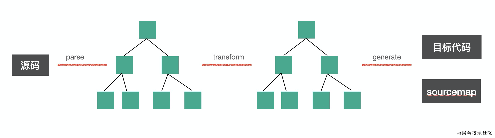
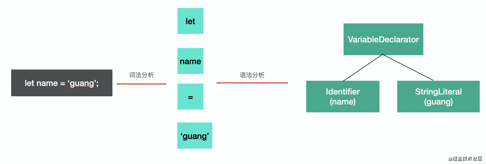
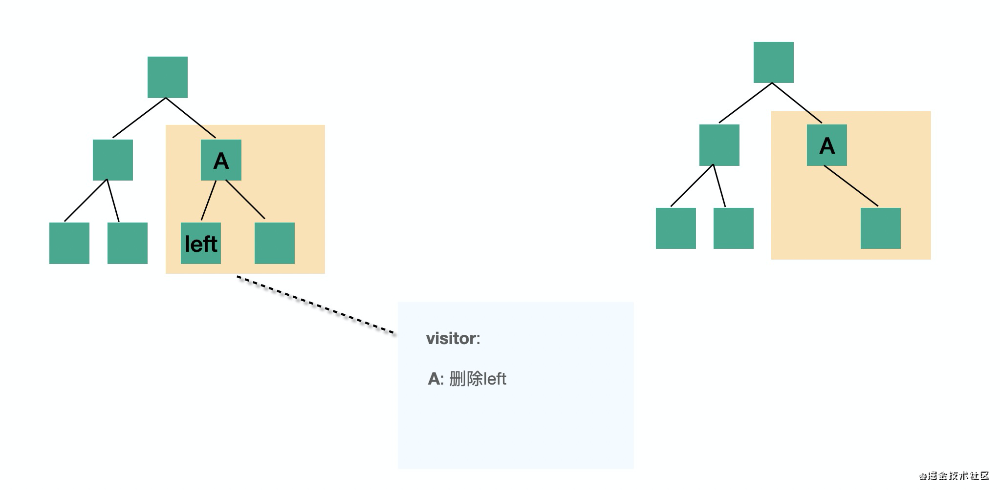
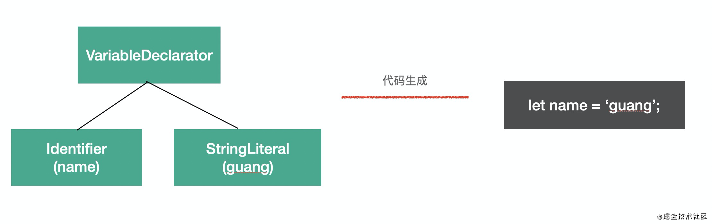

## 1. babel 的用途

* 转译代码, 例如将 ts, flow, esnext 代码转译成目标环境支持的语法
* 特定用途的代码转换, 例如函数插桩(埋点), 国际化...
* 代码的静态分析, 例如linter代码检查, api文档生成等

## 2. babel 的编译流程

总体分为三步:

* parse: 通过 parser(解析器) 将源码转化为 AST(抽象语法树)

  这个过程中分为两个步骤: 词法分析和语法分析

  * 词法分析: 将源码分成一个个不能细分的单词(token)

  * 语法分析: token 进行递归的组装，生成 AST，这个过程是语法分析，按照不同的语法结构，来把一组单词组合成对象。

    

* transform: 遍历 AST, 调用各种 transform 插件对 AST 进行操作(对 AST 进行增删改)

  对 AST 的处理过程, 会对 AST 进行遍历处理, 处理不同 AST 节点过程中会调用注册的 visitor 函数, visitor 函数会对 AST 节点进行操作, 返回新的 AST(也可以指定是否对新的 AST 进行遍历). 这样就完成了对 AST 的操作

  

* generate: 把转化后的 AST 转换为目标代码, 并生成 sourcemap

  将 AST 转化成目标代码, 例如将 IfStatement 类型转化为 `if(test) {}` 结构.

  sourcemap 记录了源码的映射

  