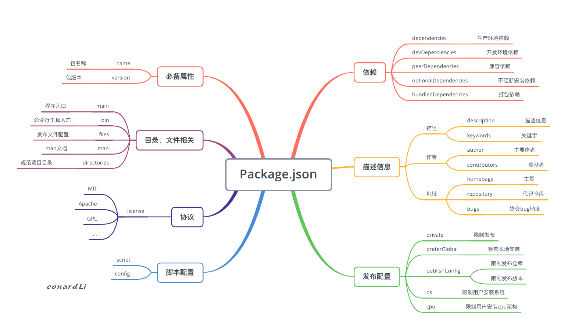
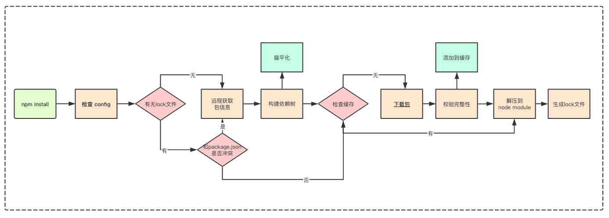

## 1. npm 常用命令

### 1.1 安装、更新、卸载操作模块

* 安装

  `npm install(i,add) <name>@<version> [-g|-global]/[-D|--save-dev|-S|--save|-f|--force（强制重新安装)]`

  > -g  | -global: 安装全局包
  >
  > -D | --save-dev：安装 devDependencies 开发依赖包
  >
  > -S | --save: 安装 dependencies 生产依赖包

* 更新

  `npm update(up, upgrade) <name>@<version> [-g|-global]/[-D|--save-dev|-S|--save]`

* 卸载

  `npm uninstall(r,un,rm,unlink,remove) <name>@<version>[-g|-global]/[-D|--save-dev|-S|--save]`


### 1.2 查看模块信息

* 查看已安装的所有模块 - 实操作用不大

  `npm list/ls/la/ll [-g]/[--depth int(整数)]`

* 查看模块安装的路径

  `npm root [-g]`

  

* 查看具体模块信息

  `npm view(info, show, v) <name> [package.json 字段] `

  

* 查看 npm 版本

  `npm -v`

* 搜索 npm 仓库

  `npm search(s, se, find) <搜索词>`

* 列出有哪些还没有升级到最新版本的依赖

  `npm outdated`

​	

### 1.3 配置 npm

```bash
npm config set <key> <value> [-g|--global]
npm config get <key>
npm config delete <key>
npm config list [-l] [--json]
npm config edit
npm get <key>
npm set <key> <value> [-g|--global]
aliases: c
```


### 1.4 其他常用命令

* 初始化项目

  `npm init [--force|-f|--yes|-y]`

* 查看 npm 命令列表

  `npm help`

* 查看 npm 各个命令的简单用法

  `npm -l`

* 缓存操作 

  。。。

**注意点：**

* **cnpm 安装包不会生成 `package-lock.json` - 2020/11/30**

* **cnpm 安装一个包会生成两个包，一个 _<pageName\>， 另一个就是 <pageName\> , 内容没有区别**

* **npm 安装包是会生成 `package-lock.json`**


## 2. package.json 文件详解

必备属性：name 和 version

```json
{
    "name": 'axios', // 包名
    "version": "0.21.0", // 版本
    /* 描述信息 */
    "description": "Promise based HTTP client for the browser and node.js", // 描述信息
    "keywords": [
    	"xhr",
    	"http",
    	"ajax",
    	"promise",
    	"node"
  	], // 关键字 - description 和 keywords 有利于模块检索
    "author": { // 作者， 就是一个人
        "name" : "Matt Zabriskie", 
    	"email" : "...", 
    	"url" : "..."
    },
    "contributors": [{ // 贡献者信息 - 可以为多个
		"name" : "...", 
    	"email" : "...",
    	"url" : "..."
    }],
    "homepage": "https://github.com/axios/axios", // 模块的主页
  	"bugs": { // 一个地址或者一个邮箱，对你的模块存在疑问的人可以到这里提出问题
    	"url": "https://github.com/axios/axios/issues"
  	},
  	"repository": { // 模块的代码仓库
    	"type": "git",
    	"url": "git+https://github.com/axios/axios.git"
  	},
    /* 描述信息 end */
    
    /* 项目依赖 */
    "dependencies": { // 生产依赖
    	"follow-redirects": "^1.10.0"
  	},
    "devDependencies": { // 开发依赖
    	"bundlesize": "^0.17.0",
    	"coveralls": "^3.0.0",
    },
    "peerDependencies": { // 项目依赖模块 - 即该模块需要运行在这些模块的环境下
        "react": ">=16.0.0", // 在 npm2 中会强制安装
    	"vue": "^2.0.0" // 但是在 npm3 中不会安装，而是在未安装的时候给出警告
    },
    "optionalDependencies": {}, // 可选依赖
    "bundledDependencies": ["package1", "package2"], // 这些模块将在这个包发布时一起打包
    /* 项目依赖 end */
    
    /* 协议: 开源协议里面详尽表述了其他人获得你代码后拥有的权利 */
    /* 以下就是几种主流的开源协议
     * 1. MIT：只要用户在项目副本中包含了版权声明和许可声明，他们就可以拿你的代码做任何想做的事情，你也无需承担任何责任。
     * 2. Apache：类似于 MIT，同时还包含了贡献者向用户提供专利授权相关的条款。
     * 3. GPL：修改项目代码的用户再次分发源码或二进制代码时，必须公布他的相关修改。
     */
    "license": "MIT",
    /* 协议 end */
    
    /* 目录、文件相关 */
    "main": "index.js", // 程序入口文件
    "bin": { // 命令行工具入口
   		"webpack-cli": "bin/cli.js"
 	},
    "files":["bin", "lib"], // npm publish 后推送模块时的文件列表，或者用 .npmignore 文件排除一些文件
	"man": [ // Linux 下的帮助指令
    	"/Users/isaacs/dev/npm/cli/man/man1/npm-access.1",
  	],
	"directories": { // 指定你的目录结构和上述的规范结构的对应情况
    	"lib": "src/lib/", // 存放可执行二进制文件的目录
    	"bin": "src/bin/", // 存放js代码的目录
    	"man": "src/man/", 
    	"doc": "src/doc/",
    	"example": "src/example/"
  	},
    /* 目录、文件相关 end */

	/* 脚本配置 */
    "script": {}, // 脚本配置
    "config": { "port": "8080" }, // 配置脚本中使用的环境变量，可通过 process.env.npm_package_config_port 获取
    /* 脚本配置 end */
    
    /* 发布配置 */
    "preferGlobal": "false", // true 表示主要用于安装到全局的命令行工具，安装到本地不会阻止安装，是发出一个警告
    "private": "true", // true 表示为私有模块， npm 将会拒绝发布
    "publishConfig": { // 发布模式时更详细的配置
        "registry": "https://registry.npmjs.org/"
    },
    "os": ["!win32"], // 表示该模块不能安装在 win32 系统上
    "cpu": ["x64", "ia32"], // 和 os 类似，可以使用 cpu 属性更加限制用户安装环境
    "engines": { // 限制用户的环境配置，但不会阻止其安装，会发出警告
    	"node": ">=10.13.0"
  	},
    /* 发布配置 end */
}
```



### 2.1 browser，module，main 字段优先级

- `main` : 定义了 `npm` 包的入口文件，browser 环境和 node 环境均可使用
- `module` : 定义 `npm` 包的 ESM 规范的入口文件，browser 环境和 node 环境均可使用
- `browser` : 定义 `npm` 包在 browser 环境下的入口文件

> [在 webpack 中，会依据 resolve.mainFields 字段来判断通过哪个字段导入](https://webpack.docschina.org/configuration/resolve/#resolvemainfields)

总结：

- 如果 `npm` 包导出的是 ESM 规范的包，使用 module
- 如果 `npm` 包只在 web 端使用，并且严禁在 server 端使用，使用 browser。
- 如果 `npm` 包只在 server 端使用，使用 main
- 如果 `npm` 包在 web 端和 server 端都允许使用，使用 browser 和 main
- 其他更加复杂的情况，如`npm` 包需要提供 commonJS 与 ESM 等多个规范的多个代码文件，请参考上述使用场景或流程图

参考：[CSDN-文章](https://blog.csdn.net/weixin_34396902/article/details/93170277)


## 3. npm 中的依赖包

### 3.1 依赖包版本号

采用了 `semver` 规范作为依赖版本管理方案，格式为：`主版本号.次版本号.修订号(x.y.z)`

* 主版本号（也称为大版本）：大版本的改动很可能是一次颠覆性的改动

* 次版本号（也称为小版本）：小版本的改动应当兼容同一个大版本内的`API`和用法，因此应该让开发者无感。

  > **如果大版本号是 0 的话，表示软件处于开发初始阶段，一切都可能随时被改变，可能每个小版本之间也会存在不兼容性。所以在选择依赖时，尽量避开大版本号是 0 的包。**

* 修订号（也称为补丁）：一般用于修复 bug 或者很细微的变更，也需要保持向前兼容

常见的几个版本格式如下：

* **"1.2.3"**

  表示精确版本号。任何其他版本号都不匹配。在一些比较重要的线上项目中，建议使用这种方式锁定版本。

* **"^1.2.3"**

  表示兼容补丁和小版本更新的版本号。官方的定义是“能够兼容除了最左侧的非 0 版本号之外的其他变化”(Allows changes that do not modify the left-most non-zero digit in the [major, minor, patch] tuple)。

  ```javascript
  "^1.2.3" 等价于 ">= 1.2.3 < 2.0.0"。即只要最左侧的 "1" 不变，其他都可以改变。所以 "1.2.4", "1.3.0" 都可以兼容。
  
  "^0.2.3" 等价于 ">= 0.2.3 < 0.3.0"。因为最左侧的是 "0"，那么只要第二位 "2" 不变，其他的都兼容，比如 "0.2.4" 和 "0.2.99"。
  
  "^0.0.3" 等价于 ">= 0.0.3 < 0.0.4"。大版本号和小版本号都为 "0" ，所以也就等价于精确的 "0.0.3"。
  ```

* **"~1.2.3"**

  表示只兼容补丁更新的版本号。关于 `~` 的定义分为两部分：如果列出了小版本号（第二位），则只兼容补丁（第三位）的修改；如果没有列出小版本号，则兼容第二和第三位的修改。我们分两种情况理解一下这个定义：

  ```
  "~1.2.3" 列出了小版本号 "2"，因此只兼容第三位的修改，等价于 ">= 1.2.3 < 1.3.0"。
  
  "~1.2" 也列出了小版本号 "2"，因此和上面一样兼容第三位的修改，等价于 ">= 1.2.0 < 1.3.0"。
  
  "~1" 没有列出小版本号，可以兼容第二第三位的修改，因此等价于 ">= 1.0.0 < 2.0.0"
  复制代码
  ```

  从这几个例子可以看出，`~` 是一个比`^`更加谨慎安全的写法，而且`~`并不对大版本号 0 或者 1 区别对待，所以 "~0.2.3" 与 "~1.2.3" 是相同的算法。当首位是 0 并且列出了第二位的时候，两者是等价的，例如 "~0.2.3" 和 "^0.2.3"。

> 详细的文档可以参见[语义化版本(semver)](https://semver.org/lang/zh-CN/)。


## 4. npm scripts 脚本

定义在 scripts 字段中，用阿里自定义脚本命令

> `npm run` 是 `npm run-script` 的缩写，一般都使用前者，但是后者可以更好的反应这个命令的本质

* 多命令执行 - 串行执行 - `&&`

  > 前一个任务执行成功后才能执行下一个任务，**只要有一个命令执行失败，则整个脚本终止**
  >
  > `npm run script1 && npm run run script2`

* 多命令执行 - 并行执行 - `&`

  > 多个命令同时的平行执行
  >
  > `npm run script1 && npm run script2`

* & 和 && 是 `Bash` 的内置功能。此外，还可以使用第三方的任务管理器模块：[script-runner](https://github.com/paulpflug/script-runner)、[npm-run-all](https://github.com/mysticatea/npm-run-all)、[redrun](https://github.com/mysticatea/npm-run-all)。

* env 环境变量

  在执行 `npm run` 脚本时，`npm`会设置一些特殊的 `env` 环境变量（**可通过 `process.env` 访问**）。

  **其中 `package.json` 中的所有字段，都会被设置为 `npm_package_` 开头的环境变量**

  ```javascript
  {
    "name": "sh",
    "version": "1.1.1",
    "description": "shenhao",
    "main": "index.js",
    "repository": {
      "type": "git",
      "url": "git+ssh://git@gitlab.com/xxxx/sh.git"
    }
  }
  ```

  可以通过`process.env.npm_package_name` 可以获取到`package.json`中`name`字段的值`sh`，也可以通过`process.env.npm_package_repository_type`获取到嵌套属性`type`的值`git`。

  同时，`npm`相关的所有配置也会被设置为以`npm_config_`开头的环境变量。

* 指令钩子

  在执行`npm scripts`命令（无论是自定义还是内置）时，都经历了`pre`和`post`两个钩子，在这两个钩子中可以定义某个命令执行前后的命令。

  比如在执行`npm run serve`命令时，会依次执行`npm run preserve`、`npm run serve`、`npm run postserve`，所以可以在这两个钩子中自定义一些动作：

  ```
  "scripts": {
    "preserve": "xxxxx",
    "serve": "vue-cli-service serve",
    "postserve": "xxxxxx"
  }
  复制代码
  ```

  当然，如果没有指定`preserve`、`postserve`，会默默的跳过。如果想要指定钩子，必须严格按照`pre`和`post`前缀来添加。

  上面提到过一个环境变量`process.env.npm_lifecycle_event`可以配合钩子来一起使用：

  ```
  const event = process.env.npm_lifecycle_event
  
  if (event === 'preserve') {
      console.log('Running the preserve task!')
  } else if (_event === 'serve') {
      console.log('Running the serve task!')
  }
  ```


## 5. package-lock.json 

npm5+ 新增功能，**`package-lock.json` 文件和 `node_module` 目录结果是一致的，即项目目录下存在`package-lock.json` 可以让每次安装生成的依赖目录结构保持相同**

* 在开发应用项目时，应该使用 `package-lock.json` 提交至版本仓库中，从而使团队成员安装的依赖版本一致
* 在开发库时，一般不使用 `package-lock.json` 锁死版本，**是因为库项目一般是被其他项目依赖的，在不写死的情况下，就可以复用主项目已经加载过的包，而一旦库依赖的是精确的版本号那么可能会造成包的冗余。**

```javascript
"dependencies": {
  "sass-loader": {
    "version": "7.1.0", // 包唯一的版本号
    "resolved": "http://registry.npm.taobao.org/sass-loader/download/sass-loader-7.1.0.tgz", // 安装源
    "integrity": "sha1-Fv1ROMuLQkv4p1lSihly1yqtBp0=", // 表明包完整性的 hash 值（验证包是否已失效）
    "dev": true, // 如果为 true，则此依赖关系仅是顶级模块的开发依赖关系或者是一个传递依赖关系
    "requires": { // 依赖包所需要的所有依赖项，对应依赖包package.json里dependencies中的依赖项
      "clone-deep": "^2.0.1",
      "loader-utils": "^1.0.1",
      "lodash.tail": "^4.1.1",
      "neo-async": "^2.5.0",
      "pify": "^3.0.0",
      "semver": "^5.5.0"
    },
    "dependencies": { // sass-loader 依赖包 node_modules 中依赖的包
      "pify": {
        "version": "3.0.0",
        "resolved": "http://registry.npm.taobao.org/pify/download/pify-3.0.0.tgz",
        "integrity": "sha1-5aSs0sEB/fPZpNB/DbxNtJ3SgXY=",
        "dev": true
      }
    }
  }
}
```


## 6. npm install 流程



* 检查 `.npmrc` 文件：优先级为：项目级的 `.npmrc` 文件 > 用户级的 `.npmrc` 文件> 全局级的 `.npmrc` 文件 > npm 内置的 `.npmrc` 文件

* 检查项目中有无 `lock` 文件。

* 无 `lock` 文件：

  * 从 `npm` 远程仓库获取包信息

  * 根据 `package.json`构建依赖树，构建过程：

    * 构建依赖树时，不管其是直接依赖还是子依赖的依赖，优先将其放置在 `node_modules` 根目录。

    * 当遇到相同模块时，判断已放置在依赖树的模块版本是否符合新模块的版本范围，如果符合则跳过，不符合则在当前模块的 `node_modules` 下放置该模块。

    * 注意这一步只是确定逻辑上的依赖树，并非真正的安装，后面会根据这个依赖结构去下载或拿到缓存中的依赖包

  * 在缓存中依次查找依赖树中的每个包

      * 不存在缓存：
  * 从 `npm` 远程仓库下载包
    
  * 校验包的完整性
    
  * 校验不通过：
        * 重新下载

      * 校验通过：
    * 将下载的包复制到 `npm` 缓存目录
        * 将下载的包按照依赖结构解压到 `node_modules`

    * 存在缓存：将缓存按照依赖结构解压到 `node_modules`
  
* 将包解压到 `node_modules`
  
* 生成 `lock` 文件

* 有 `lock` 文件：
  * 检查 `package.json` 中的依赖版本是否和 `package-lock.json` 中的依赖有冲突。
  * 如果没有冲突，直接跳过获取包信息、构建依赖树过程，开始在缓存中查找包信息，后续过程相同


## 7. npm 配置

配置优先级：**优先级为：项目级的 `.npmrc` 文件 > 用户级的 `.npmrc` 文件> 全局级的 `.npmrc` 文件 > npm 内置的 `.npmrc` 文件**

未完待续


### 参考文档：

* [掘金文章 - 前端工程化（5）：你所需要的npm知识储备都在这了](https://juejin.cn/post/6844903870578032647#heading-14)
* [掘金文章 - 前端工程化 - 剖析npm的包管理机制](https://juejin.cn/post/6844904022080667661#heading-17)
* [掘金文章 - 2018 年了，你还是只会 npm install 吗？](https://juejin.cn/post/6844903582337237006#heading-12)
* [npm 官网](https://docs.npmjs.com/cli/v6/configuring-npm/package-json#dependencies)